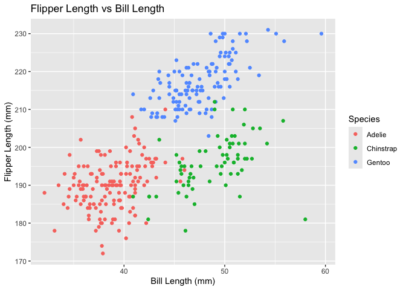

P8105 Homework 1 fb2731
================
fan bu
2026-09-26

``` r
library(tidyverse)
```

# Problem 1

``` r
data("penguins", package = "palmerpenguins")
```

The `penguins` dataset contains information on three penguin species:
Adelie, Chinstrap, Gentoo. Important variables include species, island,
bill length, bill depth, flipper length, body mass, sex, and year.

The dataset contains 344 observations and 8 variables.

The mean flipper length is 200.92 mm. \## Scatterplot

The following scatterplot shows flipper length versus bill length, with
points colored according to penguin species.

``` r
penguin_plot =
  ggplot(
    penguins,
    aes(
      x = bill_length_mm,
      y = flipper_length_mm,
      color = species
    )
  ) +
  geom_point() +
  labs(
    x = "Bill Length (mm)",
    y = "Flipper Length (mm)",
    color = "Species",
    title = "Flipper Length vs Bill Length"
  )

penguin_plot
```

    ## Warning: Removed 2 rows containing missing values or values outside the scale range
    ## (`geom_point()`).

<!-- -->

``` r
ggsave(
  filename = "penguin_scatterplot.png",
  plot = penguin_plot
)
```

    ## Saving 7 x 5 in image

    ## Warning: Removed 2 rows containing missing values or values outside the scale range
    ## (`geom_point()`).

# Problem 2

``` r
set.seed(123)

hw_df =
  tibble(
    normal_sample = rnorm(10),
    positive = normal_sample > 0,
    character_var = c(
      "a", "b", "c", "d", "e",
      "f", "g", "h", "i", "j"
    ),
    factor_var = factor(
      c(
        "low", "medium", "high", "low", "medium",
        "high", "low", "medium", "high", "low"
      )
    )
  )

hw_df
```

    ## # A tibble: 10 × 4
    ##    normal_sample positive character_var factor_var
    ##            <dbl> <lgl>    <chr>         <fct>     
    ##  1       -0.560  FALSE    a             low       
    ##  2       -0.230  FALSE    b             medium    
    ##  3        1.56   TRUE     c             high      
    ##  4        0.0705 TRUE     d             low       
    ##  5        0.129  TRUE     e             medium    
    ##  6        1.72   TRUE     f             high      
    ##  7        0.461  TRUE     g             low       
    ##  8       -1.27   FALSE    h             medium    
    ##  9       -0.687  FALSE    i             high      
    ## 10       -0.446  FALSE    j             low

## Means of the variables

``` r
mean(pull(hw_df, normal_sample))
```

    ## [1] 0.07462564

``` r
mean(pull(hw_df, positive))
```

    ## [1] 0.5

``` r
mean(pull(hw_df, character_var))
```

    ## Warning in mean.default(pull(hw_df, character_var)): argument is not numeric or
    ## logical: returning NA

    ## [1] NA

``` r
mean(pull(hw_df, factor_var))
```

    ## Warning in mean.default(pull(hw_df, factor_var)): argument is not numeric or
    ## logical: returning NA

    ## [1] NA

## Type coercion

``` r
as.numeric(pull(hw_df, positive))

as.numeric(pull(hw_df, character_var))
```

    ## Warning: NAs introduced by coercion

``` r
as.numeric(pull(hw_df, factor_var))
```

results=‘hide’
